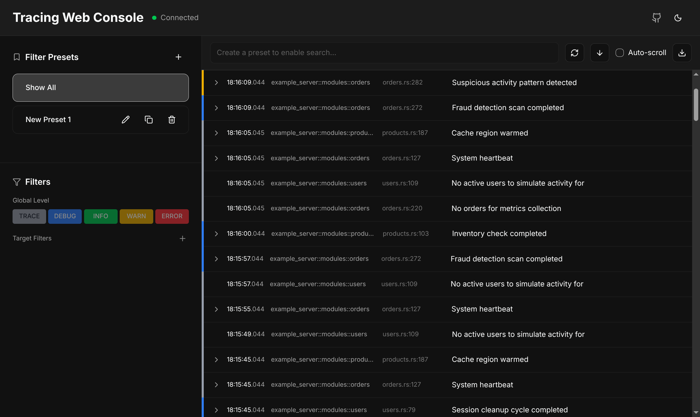
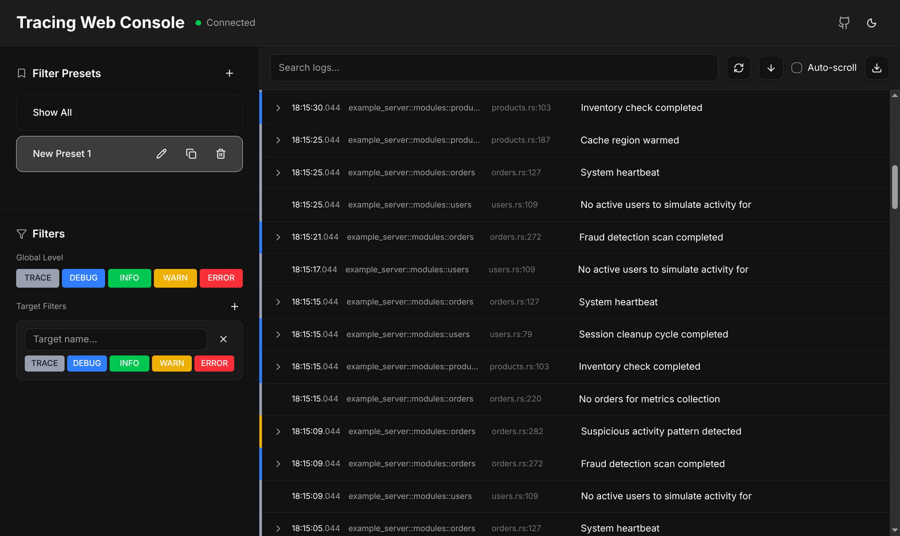
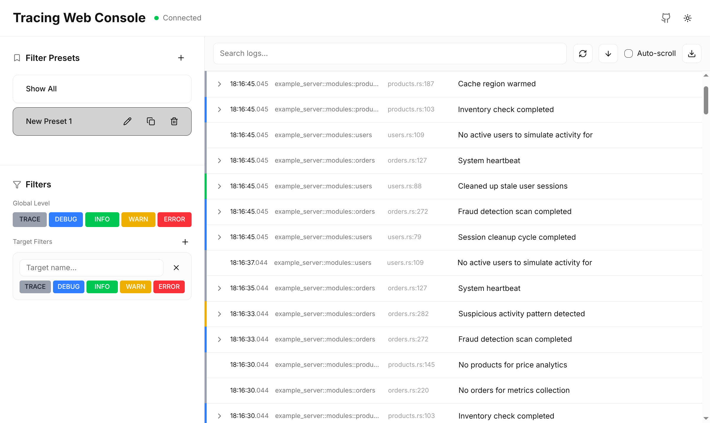
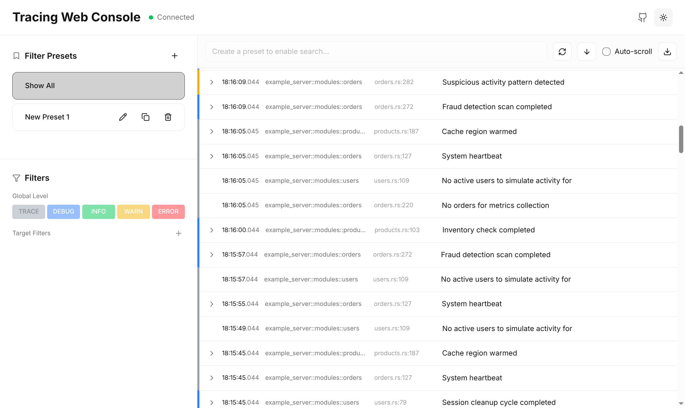

# tracing-web-console

[](https://crates.io/crates/tracing-web-console)
[](https://docs.rs/tracing-web-console)
[](LICENSE)

A real-time web-based console for Rust applications using the [tracing](https://github.com/tokio-rs/tracing) ecosystem. Drop in a single line of code to get a beautiful, interactive dashboard for monitoring your application's logs.

> **Note:** Currently only [Axum](https://github.com/tokio-rs/axum) is supported as the web framework.

> [!WARNING]
> **Development Use Only** - This tool is intended for local development and debugging purposes. It is **not suitable for production** environments because:
>
> - **No authentication** - The dashboard is publicly accessible to anyone who can reach the endpoint
> - **Potential secret exposure** - Log messages may contain sensitive data (API keys, tokens, passwords, PII)
> - **Performance impact** - Storing and streaming logs adds overhead to your application
>
> If you need production logging, consider using proper observability tools like OpenTelemetry or similar services with appropriate security controls.



## Features

- **Real-time Streaming** - Logs appear instantly via WebSocket connection
- **Virtual Scrolling** - Handles thousands of logs efficiently with smooth scrolling
- **Advanced Filtering** - Filter by log level, target, and message content
- **Target-specific Levels** - Set different log levels for different modules (e.g., `DEBUG` for your app, `WARN` for dependencies)
- **Filter Presets** - Save and quickly switch between filter configurations
- **Expandable Log Entries** - Click to view span context and additional fields
- **Context Menu** - Right-click on targets to quickly create filters
- **Dark/Light Theme** - Toggle between themes based on preference
- **Export Logs** - Download filtered logs as JSON
- **Zero Configuration** - Works out of the box with sensible defaults
- **Embedded Frontend** - No separate frontend deployment needed; assets are embedded in the binary



## Installation

Add to your `Cargo.toml`:

```toml
[dependencies]
tracing-web-console = "0.1"
```

## Quick Start

```rust
use axum::Router;
use axum::routing::get;
use tracing_web_console::TracingLayer;

#[tokio::main]
async fn main() {
    // Create your app router
    let app = Router::new()
        .route("/", get(|| async { "Hello World" }))
        // Add the tracing dashboard at /tracing
        .merge(TracingLayer::new("/tracing").into_router());

    // Start the server
    let listener = tokio::net::TcpListener::bind("0.0.0.0:3000")
        .await
        .unwrap();

    println!("Dashboard available at http://localhost:3000/tracing");

    axum::serve(listener, app).await.unwrap();
}
```

That's it! Navigate to `http://localhost:3000/tracing` to view your logs.

## Configuration

### Custom Base Path

Mount the dashboard at any path:

```rust
TracingLayer::new("/admin/logs")  // Dashboard at /admin/logs
TracingLayer::new("/debug")       // Dashboard at /debug
```

### Storage Capacity

Configure how many log events to keep in memory:

```rust
// Store up to 50,000 events (default: 10,000)
TracingLayer::with_capacity("/tracing", 50_000)
```

## Screenshots

### Dashboard Overview


### Filter Presets



### Dark Theme



## API Endpoints

The following HTTP endpoints are available under your configured base path:

| Endpoint       | Method | Description                            |
| -------------- | ------ | -------------------------------------- |
| `/`            | GET    | Serves the web dashboard               |
| `/api/logs`    | POST   | Query logs with filters and pagination |
| `/api/targets` | GET    | List all unique log targets            |
| `/api/ws`      | GET    | WebSocket endpoint for real-time logs  |

### Query Logs

```bash
curl -X POST http://localhost:3000/tracing/api/logs \
  -H "Content-Type: application/json" \
  -d '{
    "limit": 100,
    "offset": 0,
    "global_level": "debug",
    "target_levels": {"my_app": "trace"},
    "search": "error",
    "sort_order": "newest_first"
  }'
```

## Development

### Prerequisites

- Rust 1.70+
- Node.js 18+ and pnpm (for frontend development)

### Building

```bash
# Build the entire project (includes frontend)
cargo build

# Run the example server
cargo run -p example-server
```

### Frontend Development

```bash
cd tracing-web-console/frontend
pnpm install
pnpm dev  # Start dev server with hot reload
```

## How It Works

1. **TracingLayer** implements `tracing_subscriber::Layer` to capture all log events
2. Events are stored in a thread-safe circular buffer with configurable capacity
3. The web dashboard is served as embedded static assets (no external files needed)
4. Real-time updates are pushed to connected clients via WebSocket
5. Filtering is performed server-side for efficiency

## Performance Considerations

- **Circular Buffer**: Old logs are automatically evicted when capacity is reached
- **Virtual Scrolling**: The frontend only renders visible log entries
- **Server-side Filtering**: Filtering happens on the server to minimize data transfer
- **Efficient Updates**: Only new logs are sent over WebSocket, not the entire buffer

## License

This project is licensed under the GNU Affero General Public License v3.0 (AGPL-3.0). See [LICENSE](LICENSE) for details.

## Contributing

Contributions are welcome! Please feel free to submit a Pull Request.
